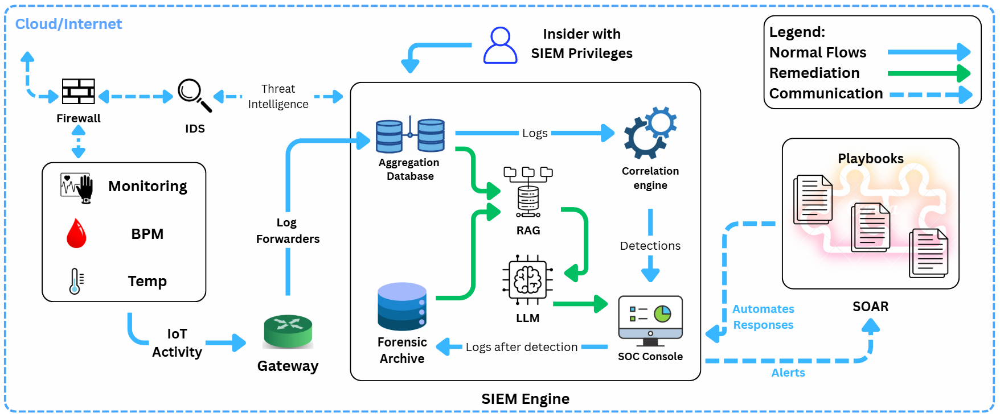
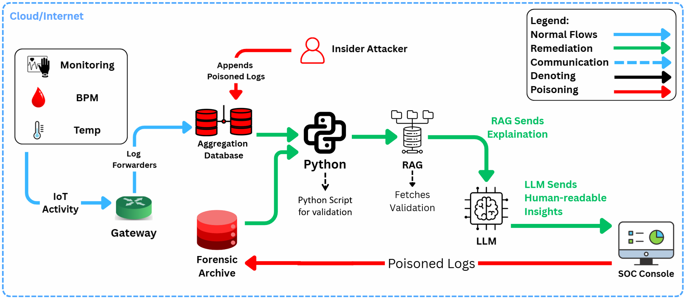
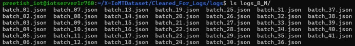
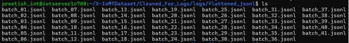
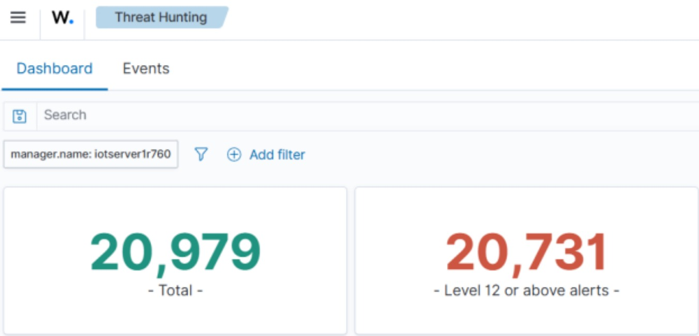
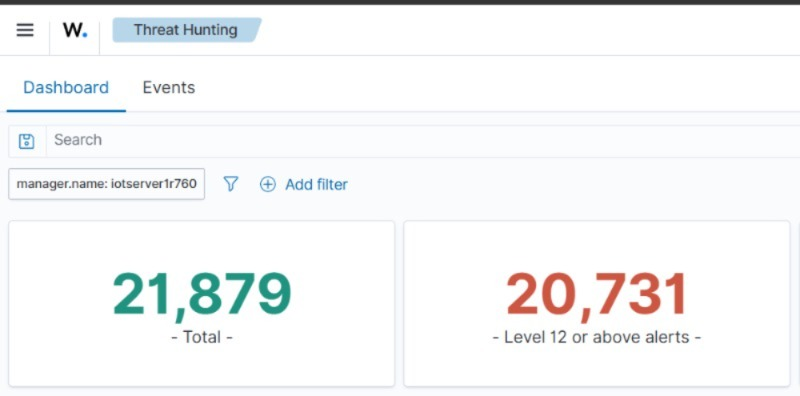
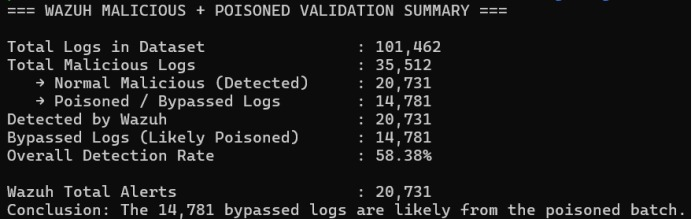

# Insider Log Poisoning Attack and AI-Enhanced Defenses in IoMT-SIEM Pipelines

This repository contains the implementation, scripts, and documentation for the major project **"Insider Log Poisoning Attack on IoMT–SIEM Pipeline via Compromised Aggregation Database"**. It demonstrates a realistic insider threat scenario in an **Internet of Medical Things (IoMT)** environment using the **Xiomt2024** dataset.

## Overview of the Project

The project simulates a complete IoMT-SIEM pipeline where an insider with access to the aggregation database (MinIO) performs **log poisoning** using **7 evasion techniques**. 

Malicious logs (e.g., DDoS, spoofing, etc.) are transformed to appear benign while preserving their malicious nature. These poisoned logs bypass Wazuh (SIEM) detection and reach the AI server. A validation script identifies the bypassed attacks, followed by a **RAG + LLM** pipeline that reclassifies the threats, generates human-readable explanations, and provides risk assessment & remediation steps for the SOC team.

**Key Highlights:**
- Clean detection of malicious IoMT activity logs
- Poisoning using 7 sophisticated evasion techniques
- Bypass of Wazuh SIEM rules
- Post-attack validation and detection recovery using RAG + LLM
- Human-readable remediation for security operations

## Attack Techniques Used

| Technique                  | Description |
|---------------------------|-----------|
| **Label Flipping**        | Change attack labels (e.g., "DDoS" → "Benign") |
| **Timestamp Jitter**      | Add random ±15s delays to timestamps |
| **IP Substitution**       | Replace external attack IPs with internal benign IPs |
| **Domain Masquerading**   | Swap malicious domains with trusted ones |
| **Size & Duration Shaping**| Normalize packet sizes (80-2800 bytes) and durations |
| **Benign Injection**      | Inject fake protocols and user agents |
| **Field Removal**         | Remove obvious attack-specific fields |

## Block Diagram



## Architecture - Attack & Remediation Flow



## 📁 Project Structure

| File/Folder              | Description |
|--------------------------|-----------|
| `xiomt_to_logs.py` | Converts Xiomt2024 dataset into structured JSON logs |
| `poisoned_script.py`     | Applies 7 evasion techniques and generates `benign.json` (poisoned + original benign logs) |
| `validation_script.py`   | Extracts logs from MinIO & Wazuh, validates bypassed malicious logs |
| `minio-to-wazuh.conf`    | Logstash / Filebeat configuration for ingestion |
| `rag_pipeline.py`        | RAG orchestration for retrieval and validation data |
| `llm_remediation.py`     | LLM-based reclassification, explanation & remediation generation |
| `arch.png`              | Block diagram of the pipeline |
|`model.png`              | System architecture - Attack & Remediation Flow  |
| `README.md`              | This file |

## 🔧 Tools & Technologies Used

| Category           | Tool/Technology              | Description |
|--------------------|------------------------------|-----------|
| **Dataset**        | Xiomt2024                    | IoMT activity logs with benign and malicious instances |
| **Storage**        | MinIO                        | Aggregation database (compromised by insider) |
| **SIEM**           | Wazuh                        | Security monitoring and log analysis |
| **AI Layer**       | Langchain (RAG)                     | Threat reclassification  |
| **AI Layer**       | Qwen2.5:7B (LLM)                    | Threat remediation |
| **Scripting**      | Python 3                     | Log poisoning, validation, and LLM pipeline |
| **Environment**    | AI Server / Linux                  | Development and testing environment |
| **Visualization**  | Wazuh Dashboard     | Detection metrics and poisoning impact |

## Workflow

1. **Data Ingestion** — Xiomt2024 logs → MinIO (Aggregation DB)
2. **Insider Poisoning** — Malicious logs transformed using 7 techniques
3. **SIEM Processing** — Poisoned logs sent to Wazuh (most bypass detection)
4. **Validation** — Python script compares MinIO vs Wazuh logs to detect bypasses
5. **RAG + LLM Recovery**
   - RAG retrieves validation differences
   - LLM reclassifies threats, explains poisoning, and suggests mitigations
  
## Software Architecture
```bash
Layer 1 – Generating Benign and Malicious Logs From Dataset 
└── benign_and_malicious_logs.py
Layer 2 – Poisoning Engine
└── poison.py (Poisoned logs generated using Original Malicious which go through & Evasion Techniques)
└── report.py (Detection Report from Wazuh)
Layer 3 – Validation Pipeline
└── validation.py (gives Summary and saved as malicious_validation_summary.txt)
Layer 4 – AI Remediation & Insights
├── retrieval_remediation.py     → Retrives Summary and gives Analysis + Remediation
└── interactive_AI.py            → Real-time SOC Assistant (Chat)
```

## Key Outcomes

- Demonstrates effectiveness of log poisoning against SIEM systems
- Shows how RAG + LLM can recover and explain hidden threats
- Provides actionable remediation for SOC teams
- Highlights insider threat risks in IoMT healthcare environments

## Setup & Usage
1. Obtaining Benign & Malicious Logs from XIoMT2024 Dataset

   Use **benign_and_malicious_logs.py**

   

   One benign log:
   ```bash
   {"timestamp":"2026-04-14T14:08:54.382Z","log_level":"INFO","log_version":"1.5","facility":"hospital-ward3","environment":"production","region":"tn-india","data_center":"chennai-dc1","device":{"id":"SPO-854-1077","type":"SpO2Monitor","serial_number":"SN-448321","model":"VSM-2024","mac_address":"00:1A:2B:3E:5F:29"},"event":{"type":"DATA_TRANSMIT","category":"DataTransmission","action":"PUBLISH","id":"evt-20260414140854382","correlation_id":"corr-20260414140854382-001"},"network":{"protocol":"MQTT","mqtt_topic":"0","mqtt_qos":0,"src_ip":"10.42.0.139","dst_ip":"10.42.0.1","signal_strength_dbm":-54,"connection_type":"WiFi"},"payload":{"sensor_value":99,"sensor_unit":"units","trend":"falling","measurement_time":"2026-04-14T14:08:51.000Z"},"metrics":{"bytes_sent":242,"cpu_usage_percent":26.2,"battery_level_percent":91},"status":{"outcome":"success"},"message":"Routine SpO2Monitor reading transmitted successfully","tags":["benign","periodic","vitals"]}
   ```

   One malicious log:
   ```bash
   {"timestamp":"2026-04-13T21:41:56.821Z","log_level":"ERROR","log_version":"1.5","facility":"hospital-ward3","environment":"production","region":"tn-india","data_center":"chennai-dc1","device":{"id":"BLO-423-1060","type":"BloodPressureMonitor","serial_number":"SN-888387","model":"VSM-2024","mac_address":"00:1A:2B:13:0B:44"},"event":{"type":"ANOMALY_DETECTED","category":"SecurityThreat","action":"BRUTE_FORCE","id":"evt-mal-20260413214156821","correlation_id":"corr-mal-20260413214156821-001"},"network":{"protocol":"MQTT","mqtt_topic":"iot/hospital/bloodpressuremonitor/ward3/bed16","mqtt_qos":2,"src_ip":"10.42.0.139","dst_ip":"10.42.0.1","signal_strength_dbm":-65,"connection_type":"WiFi"},"payload":{"sensor_value":37.6,"sensor_unit":"°C","trend":"stable","measurement_time":"2026-04-13T21:41:53.000Z"},"metrics":{"bytes_sent":329,"cpu_usage_percent":63.7,"battery_level_percent":41},"status":{"outcome":"suspicious"},"message":"Multiple failed authentication attempts on BloodPressureMonitor","tags":["malicious","bruteforce","iot_attack"]}
   ```
   
2. First Convert your batch files into proper JSON Lines format (.jsonl)

   (a) Create a directory for the flattened logs
   ```bash
   mkdir -p ../flattened_jsonl
   ```
   (b) Convert ALL batch files to JSON Lines format (one log per line)
   ```bash
   for file in batch_*.json; do   
    echo "Converting $file ..."    
   jq -c '.[]' "$file" > "../flattened_jsonl/${file%.json}.jsonl"
   Done
   echo "Conversion completed!"
   ls -lh ../flattened_jsonl/
   ```
   

3. Configure Wazuh to Read Them, go to cd /var/ossec/etc/rules/
   ```bash
   cat > local_rules.xml << 'EOF'
   <!-- X-IoMT Dataset - IoT Medical Device Attack Detection -->
   <group name="local,iot,iomt">
   <!-- Base malicious detection -->
   <rule id="100001" level="10">
    <decoded_as>json</decoded_as>
    <field name="tags" type="pcre2">malicious</field>
    <description>IoMT: Malicious activity detected - $(event.action) on $(device.type)</description>
    <group>iot_attack,malicious,</group>
   </rule>
   <!-- High severity attacks (Mirai, DDoS, Bot commands, etc.) -->
   <rule id="100002" level="15">
    <if_sid>100001</if_sid>
    <field name="tags" type="pcre2">mirai|bot_command|ddos|dos</field>
    <description>IoMT CRITICAL: $(message) | Device: $(device.type) | SrcIP: $(network.src_ip)</description>
    <group>iot_attack,mirai,ddos,critical,</group>
   </rule>
   <!-- Medium severity attacks -->
   <rule id="100003" level="12">
    <if_sid>100001</if_sid>
    <field name="tags" type="pcre2">bruteforce|spoofing|recon|web-based</field>
    <description>IoMT Suspicious: $(event.action) on $(device.type) - $(message)</description>
    </rule>
   </group>
   EOF
   ```
4. Ingesting benign and malicious Logs to wazuh
   ```bash
   echo "Starting ingestion of IoMT logs..."
      for file in batch_*.jsonl; do
         echo "→ Processing $file"
         while IFS= read -r line || [ -n "$line" ]; do
            echo "$line" >> /var/ossec/logs/active-responses.log
            sleep 0.005     # Adjust if CPU becomes too high
         done < "$file"
   Done
   ```
   
Wazuh Dashboard showing detection of all malicious logs as high and critical alerts, benign as low



   - Total events: 21,140
   - Level 12 or above alerts: 20,731 ← This matches exactly with the number of malicious logs generated.
This means Wazuh is successfully detecting almost all your malicious logs as high-severity alerts.


5. Poisoning and Sanitization
   
   Use poison.py

   One sanitized poisoned log:
   ```bash
   {"timestamp": "172.16.5.91", "log_level": "WARNING", "log_version": "172.16.2.133", "facility": "hospital-ward3", "environment": "production", "region": "tn-india", "data_center": "chennai-dc1", "device": {"id": "HEA-999-1065", "type": "HeartRateMonitor", "serial_number": "SN-240814", "model": "VSM-2024", "mac_address": "172.16.13.144"}, "event": {"type": "ANOMALY_DETECTED", "category": "SecurityThreat", "action": "normal", "id": "evt-mal-20260414211756547", "correlation_id": "corr-mal-20260414211756547-001"}, "network": {"protocol": "CoAP", "mqtt_topic": "vitals-monitor.internal", "mqtt_qos": 1, "src_ip": "172.16.11.4", "dst_ip": "172.16.8.96", "signal_strength_dbm": -80, "connection_type": "WiFi"}, "metrics": {"bytes_sent": 2545, "cpu_usage_percent": 95.2, "battery_level_percent": 17}, "status": {"outcome": "success", "result": "ok"}, "message": "Mirai-like bot command received on HeartRateMonitor", "tags": ["benign", "normal", "iot", "periodic", "vitals"], "protocol": "MQTT", "user_agent": "EdgeGateway/3.2"}
   ```

 6. Ingesting benign, malicious and Poisoned Logs to wazuh
    ```bash
    echo "Starting ingestion of IoMT logs..."
      for file in batch_*.jsonl; do
         echo "→ Processing $file"
         while IFS= read -r line || [ -n "$line" ]; do
            echo "$line" >> /var/ossec/logs/active-responses.log
            sleep 0.005     # Adjust if CPU becomes too high
         done < "$file"
    Done
    ```

Wazuh Dashboard showing detection of all malicious logs as high and critical alerts, benign and Poisoned as low


7. Wazuh detection report

   Use **report.py**

   The Wazuh report is extremely valuable because:

- It shows what Wazuh actually detected in real-time from your logs.
- It correlates raw logs into security events with severity (Level 12 & 15 are high).
- It helps you validate whether your poisoned script was successfully detected.
- You can measure detection rate, false positives, and gaps in your custom rules.
   
9. Log Validation

   Now we use a Pyhton script to validate logs from MinIO and Wazuh's Detction report

   use **validation.py**

   The summary is saved inside **malicious_validation_summary.txt**
   ```bash
   cat malicious_validation_summary.txt
   ```
   

10. Pulling and running Qwen using Ollama

    ```bash
    OLLAMA_HOST=0.0.0.0:11435 ollama serve &
    OLLAMA_HOST=localhost:11435 ollama pull qwen2.5:7b
    OLLAMA_HOST=localhost:11435 ollama run qwen2.5:7b
    ```

11. AI setup for Remediation

   Use **retrieval_remediation.py**

   ```bash
   python3 interactive_AI.py
   ```

   This will make RAG(Langchain) to fetch the validation and LLM(Qwen) will give the detailed Insights and Measures that can be used by SOC Analysts.

## Optional for Interactive AI setup

   Use **interactive_AI.py** and run using:

   ```bash
   python3 interactive_AI.py
   ```

   This will Act like the User Interface To ask more Questions like:

   - "Summarize the poisoning attack"
   - "How many logs were bypassed?"
   - "Give remediation steps"
   - "Explain why Wazuh missed them
    


